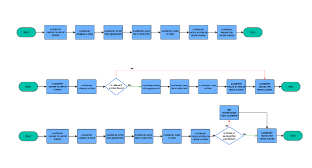
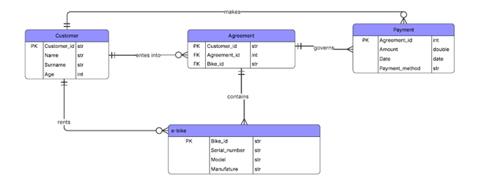
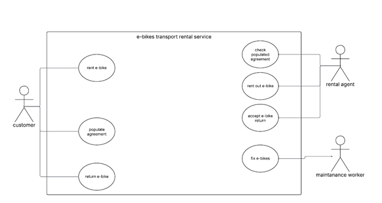
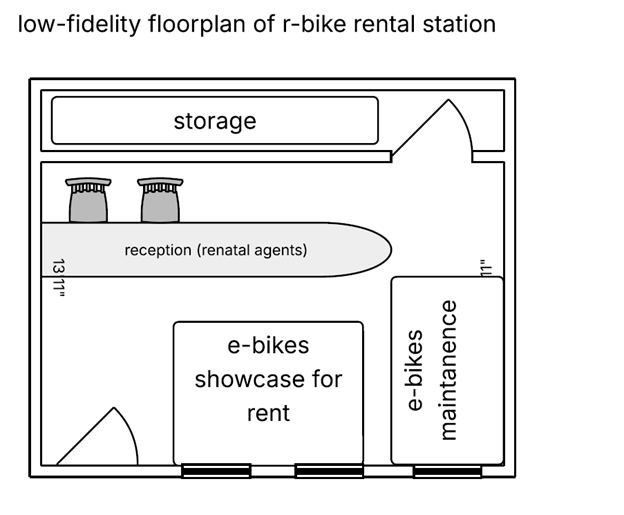

# Business Analysis Project – eBike Rental Startup

This project demonstrates end-to-end Business Analysis work for a fictional eBike rental startup (Mobi-e-rides), focusing on requirements gathering, process modeling, and solution design.

## 📌 Scope
- Stakeholder analysis
- Requirements elicitation (interviews, surveys, observation)
- MoSCoW prioritization
- Traceability matrix
- Workshop facilitation
- Process modeling (BPMN)
- Data modeling (ERD)
- Use case diagrams
- System analysis

## 🧠 My Role
I independently conducted business analysis activities based on BABOK principles, simulating a real-world startup environment.

## 📄 Project Documentation
👉 [View full project (PDF)](e_bike_project.pdf)

## 📊 Key Diagrams

### 🔄 Rental Process (BPMN)

### 🗂 Data Model (ERD)

### 👤 Use Case Diagram

### 🏢 Rental Station Layout (Low-Fidelity)

## 🔧 Skills Demonstrated
- Requirements analysis
- Stakeholder management
- Process modeling
- Analytical thinking
- Problem identification and solution design

## 🎯 Key Outcomes
- Identified stakeholder needs and potential conflicts
- Prioritized MVP requirements
- Modeled business processes and system structure
- Proposed improvements for operational efficiency
